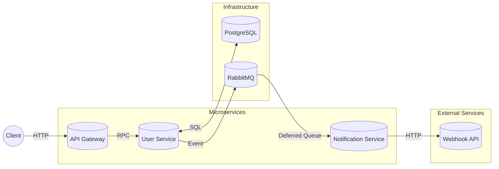

# Obrio Backend

**Scalable microservices platform built with NestJS, TypeScript, PostgreSQL/Prisma, RabbitMQ, and Docker**

---

## Fast start

```bash
npm i
cp .env.example .env
docker-compose up --build -d
```

---

## Flow and microservices interaction



- **api-gateway** - REST API entry point built with Fastify. Handles HTTP requests and forwards them to appropriate microservices via RabbitMQ RPC.
- **user-service** - Manages user CRUD operations with Prisma ORM. Emits events for user lifecycle actions (creation, updates, deletion).
- **notification-service** - Consumes deferred notification events from RabbitMQ and sends them to external webhook API. Uses Dead Letter Exchange (DLX) pattern for scheduled delivery.
- **shared** - Contains shared DTOs, constants, configuration, and utilities used across all microservices.

- **Microservices architecture** - Each service is independently deployable and scalable. Services communicate via RabbitMQ for loose coupling.
- **Deferred notifications** - RabbitMQ DLX pattern enables scheduled message delivery without external cron jobs or schedulers.
- **Pino logger** - Structured JSON logging for production with pretty-printing for local development.
- **Prisma ORM** - Type-safe database access with automatic migrations and client generation.
- **Code quality** - ESLint + Prettier configured for consistent code style with VS Code integration.

---

## Getting Started

### Prerequisites

- **Docker** 28.5+ (+ docker-compose)
- **Node.js** 24+ (LTS recommended)
- **npm** 11.6+

### Local Setup

1. **Install dependencies**:

    ```bash
    npm install
    ```

2. **Environment** - Copy `.env.example` → `.env` and configure:

    ```bash
    cp .env.example .env
    ```

    Key variables:
    - `DATABASE_URL` - PostgreSQL connection string
    - `RABBITMQ_URL` - RabbitMQ connection string
    - `NOTIFICATION_WEBHOOK_URL` - External webhook endpoint
    - `NOTIFICATION_DELAY_MS` - Notification delay in milliseconds (default: 5000)

3. **Start services** - Launch all microservices with Docker:

    ```bash
    docker-compose up --build -d
    ```

4. **Run migrations** - Apply Prisma schema to database:

    ```bash
    docker-compose exec api-gateway npx prisma migrate deploy
    ```

5. **Browse API** - Open `http://localhost:3000/api` to access the API Gateway.

---

## Notification Flow

1. **User Created** - When a user is created via API Gateway, user-service emits an event.
2. **Deferred  Queue** - Event is published to `deferred_queue` with TTL (configurable via `NOTIFICATION_DELAY_MS`).
3. **Dead Letter Exchange** - After TTL expires, message is moved to `notification_queue`.
4. **Notification Service** - Consumes message and sends HTTP POST to external webhook.

This pattern allows for scheduled notifications without polling or external schedulers.

---

## Technologies

- **NestJS** 11.1.8 - Progressive Node.js framework
- **TypeScript** 5.9.3 - Type-safe JavaScript
- **Fastify** - High-performance web framework
- **Prisma** 6.19.0 - Next-generation ORM
- **RabbitMQ** - Message broker with DLX support
- **PostgreSQL** - Relational database
- **Pino** - Fast JSON logger
- **Docker** - Containerization

---

## License

MIT
